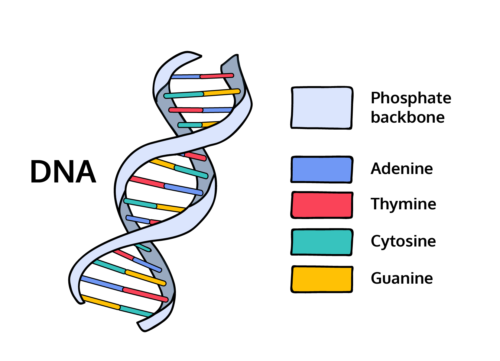

# DNA Sequencing
Write a DNA.java program that determines whether there is a protein in a strand of DNA.

 


## Context
A protein has the following qualities:

1. It begins with a “start codon”: ATG.
2. It ends with a “stop codon”: TGA.
3. In between, each additional codon is a sequence of three nucleotides.
So for example:

- ```ATGCGATACTGA``` is a protein because it has the start codon ATG, the stop codon TGA, and the length is divisible by 3.
- ```ATGCGATAGA``` is not a protein because the sequence length is not divisible by 3, so the third condition is not satisfied.

## To Do
1. Create a skeleton for the program with a class- and main method.
2. Add comment for the program
3. Store ```"ATGCGATACGCTTGA"``` ```"ATGCGATACGTGA"``` ```"ATTAATATGTACTGA"``` in three different strings: dna1, dna2, dna3
4. Warming up by finding length on the dna string.
5. Find the start/stop codon -  find the index where ATG begins using ```indexOf()```
6. Find the index where ```TGA``` begins
7. Find out whether there is any protein 
8. Create new String variable and find the protein using ```substring()``` method
9. Test the program by changing dna (dna1, dna2, dna3)

Create a generic String variable called dna that can be set to any DNA sequence (dna1, dna2, dna3).


